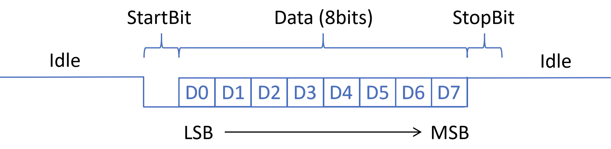
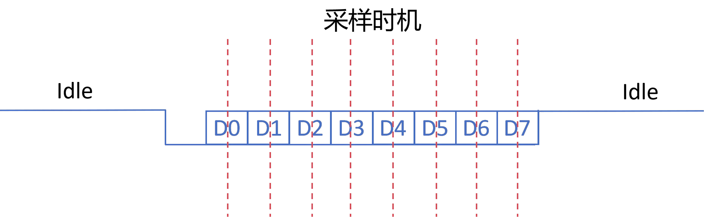
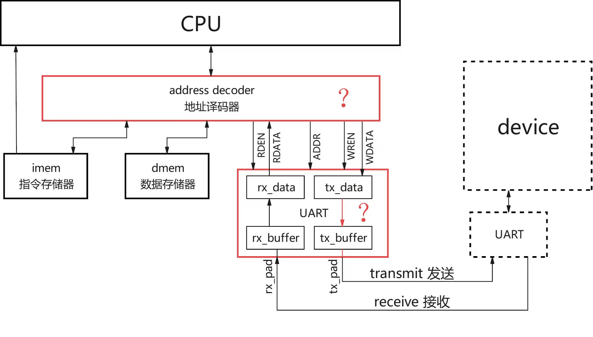

简易串口设计
=========================================

现在我们已经拥有了一个功能较完整的 RV32I 处理器，能够执行算术运算、跳转、load/store 等指令。
但是和我们平时使用的计算机相比，目前的处理器仍然非常“封闭”：
它只能从指令存储器取指，也只能通过数据存储器读写内部数据，缺少和外部世界交互的能力。

真实的计算机系统通常会连接很多外设，例如键盘、鼠标、显示器、网卡、磁盘、定时器和串口等。

本次实验中，我们将给处理器增加一个非常经典的外设：``UART`` 串口。
UART 可以让处理器向外输出字符信息，也可以进一步扩展为从外部接收输入。
在裸机系统和嵌入式系统中，串口经常被用来输出调试信息，类似于软件中的 ``print``。
因此，完成本次实验后，你的处理器就不再只是“默默运行”，而是能够通过串口把运行结果打印出来。

通过本次实验，你需要理解：

- 处理器如何通过 load/store 指令访问外设；
- 地址解码器如何根据访问地址选择 SRAM 或 UART；
- UART 串口发送的基本时序；
- 软件如何通过 UART 输入输出字符。

通过以下命令获取本次实验代码框架：

``git clone https://github.com/yuweijie-20030124/suat-compution_organization.git``

1 处理器如何与外设进行交互
~~~~~~~~~~~~~~~~~~~~~~~~~~~~~~~~~~~~~~~~~~~
在计算机系统中，处理器想要操控外设，本质上是在读写外设内部的寄存器。
这些寄存器可以是外设模块内部的一些触发器、状态机信号或组合逻辑输出。
对于处理器来说，只要它们被映射到了某个地址，处理器就可以通过普通的 ``lw``、 ``sw``、 ``lb``、 ``sb`` 等访存指令来访问它们。

这就是 MMIO （Memory Mapped I/O，**内存映射 I/O**）的核心思想：

**把外设寄存器映射到处理器的统一地址空间中，让软件像访问内存一样访问外设。**

例如，我们可以约定：

``0x1000_0000`` 这个地址不是普通内存，而是指向 UART 的发送数据寄存器。
执行以下代码时

.. code-block:: c

    *(volatile unsigned int *)0x10000000 = 'A';

处理器会发起一次 store 操作。硬件地址解码器发现访问地址位于 UART 区域，于是会把写使能信号传送给 UART 外设 。

类似的，做其他访存操作时，处理器的 MEM 阶段可能会产生一组访存相关信号，例如：

- ``mem_valid``：当前 MEM 阶段是否有一次有效访存；
- ``mem_addr``：访存地址；
- ``mem_wdata``：写入数据；
- ``mem_wen``：写使能；
- ``mem_rdata``：读出数据。

地址解码器会根据地址范围，把这些信号传送到不同的目标设备。

.. raw:: html

   

     
MMIO 和普通内存的区别

     
普通内存的读写目标是 SRAM 或 DRAM 单元，读写结果通常只是改变存储器中的数据。
     MMIO 的读写目标是外设寄存器，一次读写可能会触发一系列行为。
     例如向 UART 发送寄存器写入一个字节，可能会启动一次串口发送过程。
     读操作也可能会有副作用，可能会导致寄存器的值发生变化，稍后我们会了解原因。

   

2 地址映射
~~~~~~~~~~~~~~~~~~~~~~~~~~~~~~~~~~~~~~~~~

本次实验约定系统地址空间如下：

- ``UART``      ：``0x1000_0000 ~ 0x1000_0FFF``
- ``INST SRAM`` ：``0x8000_0000 ~ 0x8000_FFFF``
- ``DATA SRAM`` ：``0x8001_0000 ~ 0x8001_FFFF``

其中，INST SRAM 主要用于存放 ``.text`` 和 ``.rodata``。
由于你的 LSU 已经可以读取 INST SRAM，因此字符串常量、只读数组等 ``.rodata`` 可以继续放在 IMEM 中。
DATA SRAM 用于存放 ``.data``、``.bss``、堆和栈等可写数据。

UART 被映射在 ``0x1000_0000`` 开始的一小段地址空间中。
处理器只要访问这段地址，就相当于访问 UART 外设内部的寄存器。

2.1 硬件视角下的外设访问
----------------------------------------

从硬件角度看，处理器的 MEM 阶段会产生一组访存相关信号，例如：

- ``mem_valid``：当前 MEM 阶段是否有一次有效访存；
- ``mem_addr``：访存地址；
- ``mem_wdata``：写入数据；
- ``mem_wren``：写使能；
- ``mem_rden``: 读使能
- ``mem_rdata``：读出数据。

在只连接数据 SRAM 时，这些信号可以直接连接到数据存储器。
但当系统中同时存在 DATA SRAM 和 UART 时，就需要根据地址选择不同的目标设备：

- 访问 ``0x8000_0000 ~ 0x8000_FFFF`` 时，可以读取 INST SRAM 中的只读数据。
- 访问 ``0x8001_0000 ~ 0x8001_FFFF`` 时，选择 DATA SRAM；
- 访问 ``0x1000_0000 ~ 0x1000_0FFF`` 时，选择 UART；

因此，CPU 发出的 load/store 请求并不是直接连到某一个存储器，而是先经过地址解码器。
地址解码器根据地址范围产生片选信号，再把请求送到正确的设备。

2.2 地址译码
----------------------------------------------

地址译码器的框架已经提供，在 mux.v 文件中。
地址解码器简单的通过访存地址的高16位进行判断，你实际需要访问哪个设备，
然后将控制信号选通发到对应的设备，其余的设备则是无效的控制信号（置为0）。
设备则只需要拿到访存地址的低16位，以及对应的控制信号。

因此地址译码器需要拿到高16位地址(addr_i)，以及控制信号，然后通过高16位地址决定发送给谁。

这里对信号名做出解释,以此类推：

- c2dmem 代表 core to dmem ，即CPU给dmem的信号
- dmem2c 代表 dmem to core ，即dmem给CPU的信号

如下面代码所示：

.. code-block:: v

    assign c2dmem_wren_o = (addr_i == 16'h8001) ? wren_i : 4'b0;
    assign c2uart_wren_o = (addr_i == 16'h1000) ? wren_i : 4'b0;

读数据时，地址解码器同样需要根据高16位地址，从这三个设备中选择出需要的那个。

.. raw:: html

   

     
实现地址解码器

     
按照地址解码器代码框架和功能，实现地址解码器，
     在顶层中已经在访存单元接上了这三个设备 imem、dmem、uart。
     如果你实现正确，访存单元可以正常访问到这三个设备。

   

3 UART介绍
~~~~~~~~~~~~~~~~~~~~~~~~~~~~~~~~~~~~~~~~~~~

UART，全称通用异步收发器，是一种广泛使用的串行通信协议，它允许设备通过串行端口进行通信，
UART协议是异步的，意味着它不需要时钟信号来同步发送和接收数据，便可以在两个设备之间传输数据。

作为一种异步串行通信协议，UART的工作原理是逐位传输数据的每个二进制位，那如何不使用时钟信号来异步收发数据呢？
这里引入波特率的概念，波特率，即为UART每秒传输的比特的数量，通常为115200bps。两个通信设备需要在波特率达成一致才能够正确收发信号。
传输一位数据通常用一个数据包来包裹数据，通常是一个低电平0作为起始位，代表即将传输数据，
传输数据，先发送lsb，最后发送msb，一个高电平1作为停止位，代表数据传输完毕。

本次实验采用最常见的 ``8N1`` 格式，如上图所示

- 1 位起始位；
- 8 位数据位；
- 无校验位；
- 1 位停止位。

3.1 UART 寄存器设计
---------------------------------

为了让处理器通过 MMIO 访问 UART，我们需要先定义 UART 的寄存器映射。
本次实验可以采用下面的简单设计：

- ``tx_data``：地址 ``0x1000_0000``，写入低 8 位数据后启动发送；
- ``rx_data``：地址 ``0x1000_0004``，读取 UART 接收数据；

如何发送数据：
当CPU读取 tx_data 寄存器的值为0，则 UART 发送寄存器空闲，可以写入要发送的数据，
如下C代码示意， ``char inb(addr)`` 函数相当于 ``lb`` 地址读取一个字节数据。
``void outb(addr)`` 函数则相当于 ``sb`` 地址写入一个字节的数据。
当 tx_data 不为 0 时， UART 发送寄存器忙，一直循环读取，直到为 0 ，则可以写入发送数据。

3.2 软件视角下的外设访问
----------------------------------------

从软件角度看，访问 UART 可以写成下面的形式：

.. code-block:: c

    #define UART_BASE       0x10000000u
    #define UART_TX_DATA    (*(volatile unsigned int *)(UART_BASE + 0x00))
    #define UART_RX_DATA    (*(volatile unsigned int *)(UART_BASE + 0x04))

    void uart_putchar(char ch)
    {
        while (UART的发送寄存器忙) {;}
        // 直到 UART的发送寄存器空闲
        UART_TXDATA = (unsigned int)ch;
    }

这里的 ``volatile`` 非常重要。
它告诉编译器：这个地址对应的内容可能会被硬件改变，不能把读写优化掉，也不能随意合并多次访问。
如果没有 ``volatile``，编译器可能认为一直在读某个内存，内存地址的值不会变化，从而把轮询循环错误地优化掉。

.. code-block:: c

    void uart_putch(int ch) {
        while (inb(UART_TX_DATA) != 0) {;}
        outb(UART_TX_DATA, ch);
    }

如何读取数据：
当CPU读取 rx_data 寄存器值为0，则 UART 没有接收到数据，则一直循环读取，直到不为0，
则代表读取到接收数据了。如下C代码示意。

.. code-block:: c

    int uart_getch() {
        int ch = 0;
        while ((ch = inb(UART_RX_DATA)) == 0) {;}
        return ch;
    }

3.3 UART 设计实现
----------------------------------

在理解了 UART 的操作以及功能之后，终于可以来尝试实现一个简易串口了，
其中，框架代码中的 uart.v 中已经实现了绝大部分功能，缺失了发送数据的状态机，
你可以尝试理解接收数据的状态机，参照来实现。

3.3.1 发送数据状态机
...................................

要发送数据，则CPU往 tx_data 中写非零值之后，则开始启动发送数据状态机，
状态机将待发送的数据送入移位寄存器(tx_buffer)中，等待移位发送数据，同时会清空 tx_data 寄存器的值，
因为此时待发送的数据已经缓存到移位寄存器中，可以接收新的发送数据了。

分频计数器开始计数，以确保波特率满足规定。状态机会依次经历起始位（tx_pad 拉低），数据位，停止位（tx_pad 拉高），最后回到IDLE状态，
随时准备下一次数据发送。

3.3.2 接收数据状态机
....................................

这个部分已经实现，需要注意的是，接收数据状态机在发现 rx_pad 拉低之后就会开始工作，
并且由于双方的波特率不完全精准，因为分频计数的原因没办法完全达到波特率，通常会有一点误差，
因此，在接收数据时,我们不会在数据变化的边沿附近进行采样，而是在中间位置进行采样，这样可以避免小的误差。
这并不影响双方 UART 工作，协定工作一致的情况下，有很小的偏差通常不会导致接收出错。如下图所示：

因此在实现上相比发送数据寄存器更复杂，我们在数据阶段计数器计数到一半时通过移位寄存器采集数据。
直到整个数据帧接收完毕，将接收数据的移位寄存器(rx_buffer)值写入 rx_data ，当 CPU 发现值不为 0 ，
则接收到了数据， rx_data 会在每次 CPU 读该寄存器时清空值为 0 ，防止 CPU 误取到已经取走的数据。

.. raw:: html

   

     
实现简易 UART 

     
按照功能实现简易 UART ，然后你可以自己写一个tb_uart用于测试你的 UART，
     你可以发送端连接接收端，然后通过 UART 的读写端口来操作 UART ，结合仿真波形来看是否能够正常收发数据。
     UART 由于分频系数很大，需要仿真若干个周期，最后计算你的波特率是否满足要求，差了多少。

   

4 简易处理器结构
~~~~~~~~~~~~~~~~~~~~~~~~~~~~~~~~~~

至此，整个处理器的硬件设计基本完成，下面是整个处理器的结构示意图：

.. raw:: html

   

     
处理器通过仿真测试

     
我们在代码框架中给大家准备了testbench.sv用于测试你的处理器现在功能是否正常，
     由于修改了访存部分的设计，所以如果实现不正确的话，访存行为很可能不正确，比如读写控制信号没法正确传递。
     在testbench的开头需要修改为你实际的lab6的文件路径。
     运行仿真测试，通过报错信息和仿真波形修改实现，直到通过所有的指令测试。

   

