运行简易程序
=========================================

经过前面六个实验的努力，我们已经从零开始，逐步理解并完成了一个功能较完整的 RV32I 多周期处理器：
它能够执行算术运算、逻辑运算、分支跳转、访存等指令，还具备 UART 串口外设，可以通过 MMIO 与外部世界进行输入输出。

但是到目前为止，我们的处理器还只存在于仿真环境中。
本次实验将带领大家把设计综合为真实的硬件电路，下载到 FPGA 开发板上运行，让你的处理器"活"起来。
通过这次实验，你能感受到计算机与真实物理世界是如何互动的，了解如何通过串口使键盘与计算机进行交互。

通过以下命令获取本次实验代码框架：

``https://github.com/HuangXiCi/yonex``

1 处理器 FPGA 实现
~~~~~~~~~~~~~~~~~~~~~~~~~~~~~~~~~~~~~~~~~

1.1 部分模块修改
--------------------------------------

由于 FPGA 板的限制，需要减小存储器大小，在 SUAT_top.v 文件中，将存储器的深度改为13，
如下面代码所示，否则综合会提示 FPGA 逻辑资源不够。

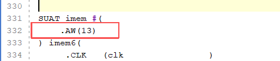

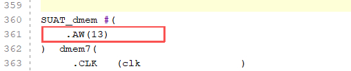

在 SUAT_imem.v 中，需要初始化我们的运行程序，我们在实验代码框架中为你准备了一个初始化文件 ``main.hex``，
请将这个文件绝对路径替换到 initial 初始化中，这样在imem中就会初始化完成运行程序，如下图所示：

1.2 添加 PLL
-------------------------------------

要让处理器跑起来，时钟是必不可少的。本次实验板卡包括了一个连接在主芯片 Y18 管脚的 100MHz 的晶振，
而本次的实验需要在50MHz的时钟频率下完成，通过需求设计，输入时钟可以驱动 PLL 产生多种频率的时钟以及相位的变化。Xilinx 提供了时钟向导 IP 核可以帮助用户设计产生不同需求的时钟。

点击左侧栏 ``PROJECT MANAGER`` 下方的 ``IP Catalog``

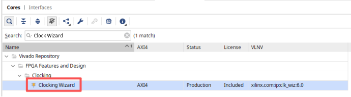

内部晶振为100MHz，要输出50MHz的时钟频率，按键是高电平有效，因此复位选择高电平有效。

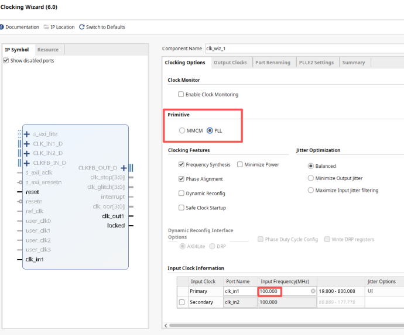

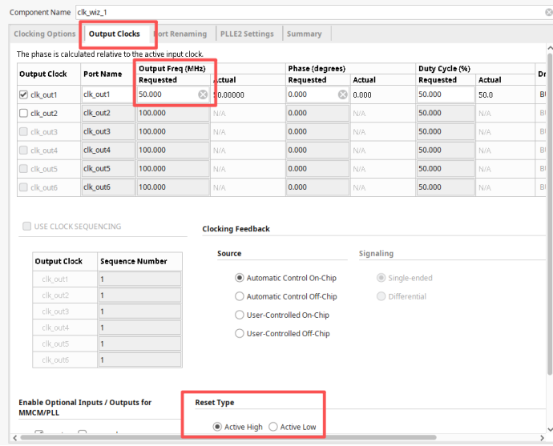

通过上图配置可以获得一个50MHz的时钟频率给CPU使用，此时这个ip文件被放在工程文件下 ``ip_user_files/ip/clk_wiz_0`` 中。

.. code-block:: v

   module clk_wiz_0(clk_out1, reset, locked, clk_in1)
      output clk_out1;
      input reset;
      output locked;
      input clk_in1;
   endmodule

认识一下 PLL 的信号， PLL 会输入一个参考时钟频率，输出一个需要的时钟频率。
复位信号也很容易理解，我们的 FPGA 板上的按键按下是高电平，因此复位选择高电平有效。

locked信号用来指示 PLL 输出时钟的工作状态，为1时代表工作稳定，0代表还不稳定。
因此locked信号常用作系统的复位信号，不用担心系统使用同步复位信号因为没有时钟导致没有正常复位的情况。

因此推荐你使用locked信号作为系统的复位信号，如果极性不一致，取反即可。检查你的所有模块的复位极性是否一致，
如果不一致，则需要修改为一致。

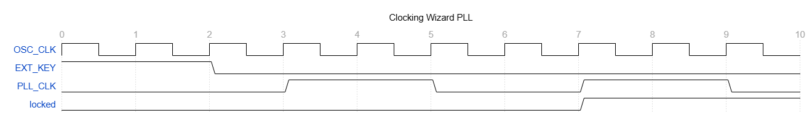

1.3 添加顶层文件
-----------------------------------------

我们可以添加一个顶层模块，这个模块实例化了 SUAT_top 以及 PLL ，并将端口正确相连。
顶层文件应该有4个端口，外部晶振时钟输入，外部按键复位输入，UART 的 TX 和 RX 端口。

**外部晶振连接管脚Y18，频率为100Mhz。外部复位使用按键 S6 ，对应 P20 管脚。UART 的 TX 连接 V18 管脚， RX 连接 Y19 管脚。**
其中V18和Y19管脚是 FPGA 板上连接 USB-UART 的管脚，连接正确后就可以通过 USB-UART 与计算机进行串口通信了。

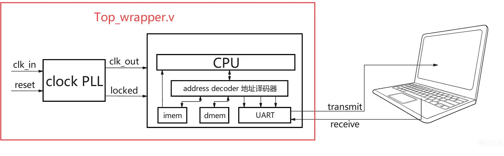

所有的管脚电平标准都选择 ``LVCMOS33`` ，下面给出约束文件示例，你也可以使用图形化方式绑定管脚。

.. code-block:: v

   set_property PACKAGE_PIN V18 [get_ports tx_pad]
   set_property IOSTANDARD LVCMOS33 [get_ports tx_pad]
   set_property PACKAGE_PIN Y19 [get_ports rx_pad]
   set_property IOSTANDARD LVCMOS33 [get_ports rx_pad]

接下来就可以生成比特流，写入 FPGA 。

2 运行简易程序
~~~~~~~~~~~~~~~~~~~~~~~~~~~~~~~~~~~~~~~~~~~

我们需要使用串口工具来接收和发送串口信号。

**在Windows上，可以使用 MobaXterm 连接串口。**
选择正确的端口和波特率，即可连接串口。

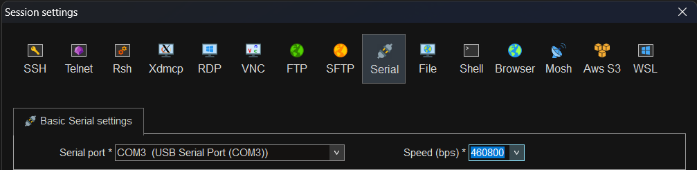

|

**在 Ubuntu 下**，可以 ``sudo apt install minicom`` 安装 minicom。
使用 ``sudo minicom -s`` 打开 minicom ，查看设备 ``ls -l /dev/ttyUSB*`` ，
在 minicom 里面选择对应设备和波特率，即可连接串口。

如果你的串口实现正确，那你应该可以看到串口输出信息显示在你的屏幕上。

2.1 第一个程序
-------------------------------------------

我们在代码框架中为你准备了一个简单的程序，运行后会在串口输出 Hello SUAT ，并且等待用户输入，
当你按下按键后，CPU 会读取输入，并将输入的字符发出来，因此你应该可以看到，当你键入 A ，你的串口工具上就会显示 A。

这个程序在 yonex/src/main 中，你可以修改这个程序，比如输入小写的字母，会输出大写的字母。

我们还给你准备了3个小程序，在 yonex/src/demo 文件夹中，赶紧来看看吧。

2.2 谁不想拥有一只绝世好猫
----------------------------------------------------

有一只脑袋圆圆且脾气温和的绝世好猫，名字叫圆头耄耋，它平时最大的爱好就是哈气。
左图是耄耋平时乖巧可爱的样子，如果你按下键盘任意按键，耄耋就会对你哈气。

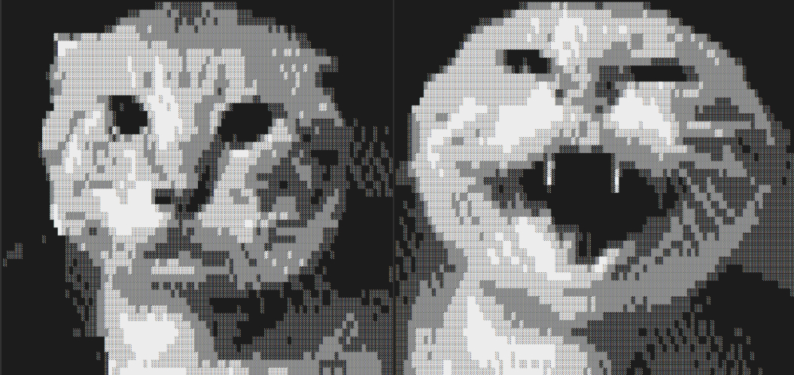

不要害怕，耄耋很温和，不会伤害你，过几秒钟，它就会恢复如初。

上面的演示程序是一个简单的交互式程序，它的工作流程如下：

1. 处理器启动后，通过 UART 向外发送小猫的 ASCII 字符串，在 yonex/include/data.h 中；
2. 程序进入等待循环，不断检测 UART 接收寄存器（rx_data）是否有数据；
3. 当用户按下键盘上的任意按键时，串口工具将按键字符通过 USB-UART 发送给 FPGA；
4. 处理器的 UART 外设接收到数据后，程序检测到 rx_data 不为 0；
5. 程序切换到"哈气耄耋"的 ASCII 字符串，通过 UART 发送出去；
6. 软件延时一段时间后，程序重新发送"乖巧耄耋"的字符串，回到等待状态。

这个演示程序虽然简单，但它涵盖了处理器与外设交互的核心流程：
**轮询 UART 接收 → 处理 → 发送 UART 数据**。

在实验代码框架根目录中， ``make hachimi`` 就会在build目录中编译 hachimi.hex ，将 imem.v 中的初始化文件替换为 hachimi.hex，重新生成比特流即可。
去跟圆头耄耋互动吧。

2.3 2048小游戏
------------------------------------------

2048 是 经典益智小游戏，玩家通过上下左右滑动方块，将相同的数字合并，目标是组合出2048方块。

1. 棋盘与初始数字：游戏在4×4的方格棋盘上进行，初始会随机生成两个数字方块，通常为2或4。 
2. 移动与合并：玩家每次可以选择上下左右一个方向滑动，所有方块会向该方向靠拢。相同数字的方块碰撞时会合并，合并后的数字为原数字之和（如2+2=4，4+4=8）。 
3. 新增方块：每次有效移动后，系统会在空白格随机生成一个新方块，90%概率为2，10%概率为4。 
4. 得分机制：每次合并的数字即为得分，分数累加。
5. 游戏结束条件：当棋盘被填满且没有可合并的相邻方块时，游戏结束。

我们的2048是字符串版本，界面比较简陋，WASD用于上下左右移动，Q直接结束本局，R直接开启新的一局,
按键不区分大小写。每次开局之前需要按下任意按键作为随机数种子。

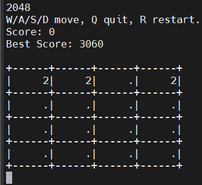

同样，使用 ``make 2048`` 即可编译出 2048.hex，放入imem.v中，重新生成比特流下载到FPGA上。

.. raw:: html

   

     
GAME 2048

     
不来玩一下2048吗，将你的最好记录截屏放在实验报告中。
     2048好的策略是什么呢，如何能够得到更大的数字，写下你的看法。

   

2.4 旋转甜甜圈
----------------------

旋转甜甜圈，短短数百行代码，即可输出一个旋转甜甜圈，这个甜甜圈也是字符版本的。
字符的密度代表亮度，比如 ``@`` 的亮度就比 ``.`` 高， .,-~:;=!*#$@ 这些字符的亮度依次升高。
这些高亮和阴影会带给我们 3D 效果的感觉，如下 GIF 所示。

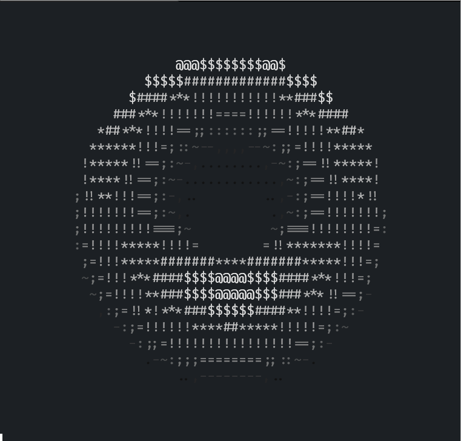

受限于处理器性能限制，我们的甜甜圈尺寸会更小，需要大概2秒计算完1帧画面，因此实际效果并不是很好。
下面是 donut.c 的混淆代码，刻意调整为了甜甜圈的形状。
同样， ``make donut`` 生成 donut.hex，快去处理器上试试旋转甜甜圈吧。

.. code-block:: v

                   int main(void){char b[1760];
              screen_reset();signed char z[1760];
         int sA=1024,cA=0,sB=1024,cB=0,_;const int
       R2=2048,K2=5120*1024;while(1){memset(b,32,1760)
     ;memset(z,127,1760);int sj=0,cj=1024;for(int j=0;j<60
    ;j++){int si=0,ci=1024;for(int i=0;i<216;i++){int x0=cj
   +R2,x1=ci*x0>>10,x2=cA*sj        >>10,x3=si*x0>>10,x4=x2-
  (sA*x3>>10),x5=sA*sj>>               10,x6=K2+1024*x5+cA*x3
 ,x7=cj*si>>10;int cbx1                 =cB*x1,sbx4=sB*x4;int
 x=25+pdiv(30*(cbx1-sbx4               ),x6),y=12+pdiv(15*(cB
 *x4+sB*x1),x6),N=(((-cA*              x7-cB*((-sA*x7>>10)+x2
  )-ci*(cj*sB>>10))>>10)-             /**/x5)>>7;int o=x+80*y;
   signed char zz=(x6-K2)>>15;if(22>y&&y>0&&x>0&&80>x&&zz<z[o
    ]){z[o]=zz;b[o]=".,-~:;=!*#$@"[N>0?N:0];}R(8,8,ci,si);}
      R(14,7,cj,sj);}R(5,7,cA,sA);R(5,8,cB,sB);/*donut.c*/
        screen_clear();for(int y=0;y<22;y++){uart_putstr
          ("\n");char tmp=b[y*80+50];b[y*80+50]='\0';
              uart_putstr(&b[y*80]);b[y*80+50]=
                  tmp;}}return 0;}//by hxc.

.. raw:: html

   

     
旋转甜甜圈donut

     
如果你对这段代码，其背后的原理感兴趣，在互联网上搜索donut的原理，
     你可以动手实现一个python的版本，每秒几十帧画面的效果会好很多，
     就像 GIF 图那样。

   

恭喜你完成了全部七个实验！
从第一行汇编代码，到 ALU、单周期处理器、多周期处理器、UART 外设，
再到 FPGA 上运行你自己的程序——你已经亲手构建了一台能够真正运行的计算机。
虽然简单，但你已经触摸到了"计算机组成原理"。
